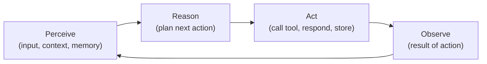

## Mission Brief

An AI *agent* is more than a chatbot — it's an AI that reasons about what to do, takes actions, observes results, and iterates until a goal is achieved. This mission teaches you the agent loop and how to build one from scratch.

> **Track:** Operative `••` | **Time:** 60 minutes | **Prerequisites:** Complete Recruit Track

## Learning Objectives

By the end of this mission, you will:

1. Understand what makes an AI system an "agent" vs. a chatbot
2. Implement the core agent loop: observe → reason → act → repeat
3. Give agents persistent memory across turns
4. Build a task-oriented agent with a defined goal
5. Understand when agents are (and aren't) the right solution

## What is an AI Agent?



An agent differs from a standard LLM call in three key ways:

| Chatbot | Agent |
|---------|-------|
| Single request → response | Multi-step reasoning loop |
| No persistent state | Memory between steps |
| No actions | Can call tools, write files, search |
| Reactive | Goal-directed |

## Hands-On Lab

### Step 1: The Basic Agent Loop

```python
import anthropic
import json

client = anthropic.Anthropic()

SYSTEM = """You are a task-completion agent. When given a goal, you break it into steps,
complete each step, and report back. Always confirm when the goal is fully achieved.

Format your responses as:
THINKING: <your reasoning>
ACTION: <what you're doing>
RESULT: <outcome>
STATUS: <WORKING | COMPLETE>"""

def run_agent(goal: str, max_steps: int = 10) -> None:
    print(f"Goal: {goal}\n{'='*50}")
    history = [{"role": "user", "content": f"Complete this goal: {goal}"}]

    for step in range(1, max_steps + 1):
        print(f"\n[Step {step}]")

        response = client.messages.create(
            model="claude-sonnet-4-6",
            max_tokens=512,
            system=SYSTEM,
            messages=history,
        )

        assistant_text = response.content[0].text
        print(assistant_text)
        history.append({"role": "assistant", "content": assistant_text})

        if "STATUS: COMPLETE" in assistant_text:
            print(f"\nAgent completed goal in {step} steps.")
            break

        # Continue the loop
        history.append({
            "role": "user",
            "content": "Continue working on the goal. What's your next step?"
        })

run_agent("Create a study plan for learning machine learning in 30 days")
```

### Step 2: Agent with Memory

```python
import anthropic
from datetime import datetime

client = anthropic.Anthropic()

class AgentMemory:
    def __init__(self):
        self.facts: list[str] = []
        self.tasks_completed: list[str] = []
        self.session_start = datetime.now()

    def add_fact(self, fact: str):
        self.facts.append(fact)

    def complete_task(self, task: str):
        self.tasks_completed.append(task)

    def to_context(self) -> str:
        if not self.facts and not self.tasks_completed:
            return ""
        lines = ["<memory>"]
        if self.facts:
            lines.append("Known facts:")
            lines.extend(f"  - {f}" for f in self.facts[-10:])
        if self.tasks_completed:
            lines.append("Completed tasks:")
            lines.extend(f"  - {t}" for t in self.tasks_completed[-5:])
        lines.append("</memory>")
        return "\n".join(lines)

class PersonalAssistantAgent:
    def __init__(self):
        self.memory = AgentMemory()
        self.history = []

    def chat(self, user_input: str) -> str:
        memory_context = self.memory.to_context()
        system = f"""You are a personal assistant agent with persistent memory.
{memory_context}

When you learn something important about the user, note it with: REMEMBER: <fact>
When you complete a task, note it with: DONE: <task>"""

        self.history.append({"role": "user", "content": user_input})

        response = client.messages.create(
            model="claude-sonnet-4-6",
            max_tokens=512,
            system=system,
            messages=self.history,
        )

        reply = response.content[0].text

        # Extract memory updates
        for line in reply.split("\n"):
            if line.startswith("REMEMBER:"):
                self.memory.add_fact(line[9:].strip())
            elif line.startswith("DONE:"):
                self.memory.complete_task(line[5:].strip())

        self.history.append({"role": "assistant", "content": reply})
        return reply

# Run the assistant
agent = PersonalAssistantAgent()
print(agent.chat("I'm Priya, a software engineer learning AI. My main goal is to build an AI product by Q3."))
print("\n---\n")
print(agent.chat("What do you know about me so far?"))
```

### Step 3: Goal-Oriented Research Agent

```python
import anthropic

client = anthropic.Anthropic()

def research_agent(topic: str) -> dict:
    """An agent that produces a structured research summary."""
    history = []

    steps = [
        f"What are the 5 most important concepts to understand about: {topic}?",
        "For each concept, give a 2-sentence explanation at the level of an intermediate developer.",
        "What are the top 3 practical applications of this topic in real software products?",
        "Compile everything into a structured JSON report with keys: topic, concepts (list), applications (list), next_steps (list).",
    ]

    for step in steps:
        history.append({"role": "user", "content": step})
        response = client.messages.create(
            model="claude-sonnet-4-6",
            max_tokens=1024,
            system="You are a technical researcher. Be precise and practical.",
            messages=history,
        )
        reply = response.content[0].text
        history.append({"role": "assistant", "content": reply})

    # Final step: extract the JSON
    import json, re
    json_match = re.search(r'\{.*\}', reply, re.DOTALL)
    if json_match:
        return json.loads(json_match.group())
    return {"raw": reply}

result = research_agent("vector embeddings and semantic search")
print(result)
```

---

## Mission Complete

You now understand and can build AI agents:

- [x] The agent loop: perceive → reason → act → observe
- [x] Persistent memory across conversation turns
- [x] Goal-directed multi-step task completion
- [x] Agentic research and information synthesis

---

## Navigation

**← Previous:** [RECRUIT-04: Prompt Engineering Fundamentals](/posts/recruit-04-prompt-engineering/)  
**Next Mission →** [OPERATIVE-02: Tool Use & Function Calling](/posts/operative-02-tool-use/)
