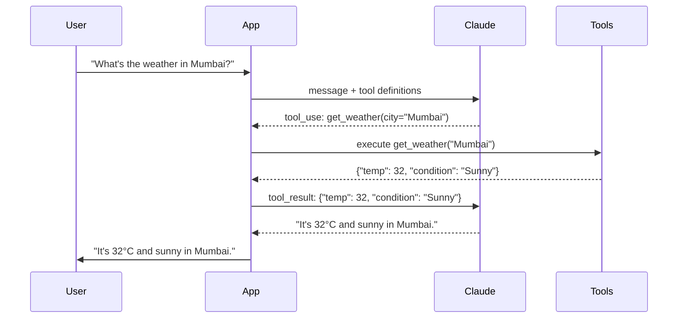

## Mission Brief

Tool use (also called function calling) is what transforms Claude from a text generator into an action-taking agent. You define tools, Claude decides when to call them, and your code executes them — creating a powerful human-AI-system collaboration.

> **Track:** Operative `••` | **Time:** 75 minutes | **Prerequisites:** [OPERATIVE-01](/posts/operative-01-ai-agents/)

## Learning Objectives

By the end of this mission, you will:

1. Define tools using the Anthropic tool schema
2. Implement the tool use loop correctly
3. Build a multi-tool agent with real function execution
4. Handle tool errors and edge cases
5. Know when to use tools vs. model knowledge

## How Tool Use Works



## Hands-On Lab

### Step 1: Define Your First Tool

```python
import anthropic
import json

client = anthropic.Anthropic()

# Tool definition — tells Claude what the tool does and what parameters it needs
TOOLS = [
    {
        "name": "get_weather",
        "description": "Get the current weather for a city. Returns temperature in Celsius and weather condition.",
        "input_schema": {
            "type": "object",
            "properties": {
                "city": {
                    "type": "string",
                    "description": "The city name, e.g. 'Mumbai', 'London'"
                }
            },
            "required": ["city"]
        }
    }
]

# Simulated tool implementation
def get_weather(city: str) -> dict:
    weather_db = {
        "Mumbai": {"temp": 32, "condition": "Sunny", "humidity": 78},
        "London": {"temp": 14, "condition": "Cloudy", "humidity": 82},
        "Tokyo": {"temp": 21, "condition": "Clear", "humidity": 60},
    }
    return weather_db.get(city, {"error": f"Weather data not available for {city}"})

# Execute a tool by name
def execute_tool(name: str, inputs: dict) -> str:
    if name == "get_weather":
        result = get_weather(**inputs)
        return json.dumps(result)
    return json.dumps({"error": f"Unknown tool: {name}"})
```

### Step 2: The Tool Use Loop

```python
def run_with_tools(user_message: str) -> str:
    messages = [{"role": "user", "content": user_message}]

    while True:
        response = client.messages.create(
            model="claude-sonnet-4-6",
            max_tokens=1024,
            tools=TOOLS,
            messages=messages,
        )

        # If Claude responded with text, we're done
        if response.stop_reason == "end_turn":
            return next(
                block.text for block in response.content if hasattr(block, "text")
            )

        # Claude wants to use a tool
        if response.stop_reason == "tool_use":
            # Add Claude's response (may include text + tool calls) to history
            messages.append({"role": "assistant", "content": response.content})

            # Execute all tool calls
            tool_results = []
            for block in response.content:
                if block.type == "tool_use":
                    print(f"  [Tool call: {block.name}({block.input})]")
                    result = execute_tool(block.name, block.input)
                    tool_results.append({
                        "type": "tool_result",
                        "tool_use_id": block.id,
                        "content": result,
                    })

            # Return tool results to Claude
            messages.append({"role": "user", "content": tool_results})

print(run_with_tools("What's the weather like in London and Tokyo?"))
```

### Step 3: Multi-Tool Agent

Build an agent with several tools:

```python
import anthropic
import json
import math
from datetime import datetime

client = anthropic.Anthropic()

MULTI_TOOLS = [
    {
        "name": "calculator",
        "description": "Evaluate a mathematical expression. Use for arithmetic, percentages, unit conversions.",
        "input_schema": {
            "type": "object",
            "properties": {
                "expression": {"type": "string", "description": "Math expression, e.g. '2 ** 10', 'sqrt(144)'"}
            },
            "required": ["expression"]
        }
    },
    {
        "name": "get_current_time",
        "description": "Get the current date and time in a given timezone.",
        "input_schema": {
            "type": "object",
            "properties": {
                "timezone": {"type": "string", "description": "Timezone name, e.g. 'Asia/Kolkata', 'UTC'"}
            },
            "required": ["timezone"]
        }
    },
    {
        "name": "lookup_definition",
        "description": "Look up the definition of an AI/ML term from the workshop glossary.",
        "input_schema": {
            "type": "object",
            "properties": {
                "term": {"type": "string", "description": "The AI/ML term to define"}
            },
            "required": ["term"]
        }
    }
]

GLOSSARY = {
    "llm": "Large Language Model — a neural network trained on vast text data to understand and generate human language.",
    "rag": "Retrieval-Augmented Generation — a technique combining a retrieval system with an LLM for knowledge-grounded responses.",
    "embedding": "A numerical vector representation of text that captures semantic meaning in a high-dimensional space.",
    "agent": "An AI system that perceives its environment, reasons, and takes actions autonomously to achieve goals.",
    "fine-tuning": "Further training a pre-trained model on domain-specific data to improve performance on targeted tasks.",
}

def execute_multi_tool(name: str, inputs: dict) -> str:
    if name == "calculator":
        try:
            safe_env = {"sqrt": math.sqrt, "log": math.log, "pi": math.pi}
            result = eval(inputs["expression"], {"__builtins__": {}}, safe_env)
            return json.dumps({"result": result})
        except Exception as e:
            return json.dumps({"error": str(e)})

    elif name == "get_current_time":
        now = datetime.utcnow()
        return json.dumps({"datetime": now.strftime("%Y-%m-%d %H:%M UTC"), "timezone": inputs["timezone"]})

    elif name == "lookup_definition":
        term = inputs["term"].lower()
        definition = GLOSSARY.get(term, f"Term '{inputs['term']}' not found in the workshop glossary.")
        return json.dumps({"term": inputs["term"], "definition": definition})

    return json.dumps({"error": f"Unknown tool: {name}"})

def agent_with_tools(question: str) -> str:
    messages = [{"role": "user", "content": question}]
    system = "You are a helpful AI workshop assistant. Use available tools when they can provide accurate information."

    while True:
        response = client.messages.create(
            model="claude-sonnet-4-6",
            max_tokens=1024,
            system=system,
            tools=MULTI_TOOLS,
            messages=messages,
        )

        if response.stop_reason == "end_turn":
            return next(b.text for b in response.content if hasattr(b, "text"))

        if response.stop_reason == "tool_use":
            messages.append({"role": "assistant", "content": response.content})
            tool_results = []
            for block in response.content:
                if block.type == "tool_use":
                    result = execute_multi_tool(block.name, block.input)
                    tool_results.append({
                        "type": "tool_result",
                        "tool_use_id": block.id,
                        "content": result,
                    })
            messages.append({"role": "user", "content": tool_results})

# Test it
print(agent_with_tools("What is 2 to the power of 16, and what is RAG in AI?"))
```

---

## Mission Complete

You've mastered tool use — the superpower of AI agents:

- [x] Tool schema definition
- [x] The tool use loop (request → execute → return result)
- [x] Multi-tool agents with real function dispatch
- [x] Error handling for tool failures

---

## Navigation

**← Previous:** [OPERATIVE-01: Building Conversational AI Agents](/posts/operative-01-ai-agents/)  
**Next Mission →** [OPERATIVE-03: Retrieval-Augmented Generation](/posts/operative-03-rag/)
