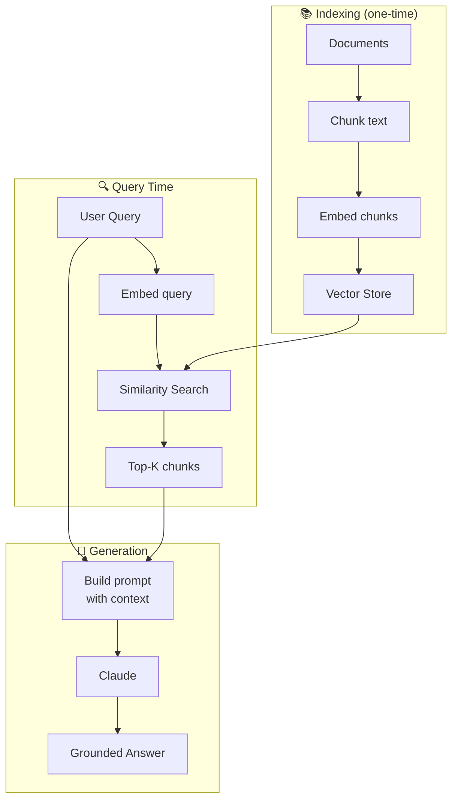

## Mission Brief

LLMs have a knowledge cutoff and can hallucinate facts. RAG (Retrieval-Augmented Generation) solves this by retrieving relevant documents at query time and grounding the AI's response in actual content — making AI reliable for knowledge-specific applications.

> **Track:** Operative `••` | **Time:** 90 minutes | **Prerequisites:** [OPERATIVE-02](/posts/operative-02-tool-use/)

## Learning Objectives

By the end of this mission, you will:

1. Understand what embeddings are and how semantic search works
2. Build a document ingestion pipeline (chunk → embed → store)
3. Implement semantic search to find relevant documents
4. Combine retrieval with generation for grounded answers
5. Evaluate RAG answer quality

## How RAG Works



## What are Embeddings?

An **embedding** is a vector (list of numbers) that represents the *semantic meaning* of text. Similar meanings produce similar vectors, enabling semantic search.

For example, these sentences have similar embeddings even though they share no words:
- "The dog chased the ball"
- "A canine was running after a sphere"

Similarity is measured with **cosine similarity**:

$$\text{similarity}(A, B) = \frac{A \cdot B}{\|A\| \|B\|}$$

A score of 1.0 = identical meaning. A score near 0 = unrelated.

## Hands-On Lab

### Step 1: Generate Embeddings

```python
import anthropic
import numpy as np

client = anthropic.Anthropic()

def embed(text: str) -> list[float]:
    """Generate an embedding vector for a piece of text."""
    response = client.embeddings.create(
        model="voyage-3",
        input=text,
    )
    return response.embeddings[0].embedding

def cosine_similarity(a: list[float], b: list[float]) -> float:
    a, b = np.array(a), np.array(b)
    return float(np.dot(a, b) / (np.linalg.norm(a) * np.linalg.norm(b)))

# Test semantic similarity
texts = [
    "Machine learning is a subset of artificial intelligence",
    "AI and ML are related fields in computer science",
    "Python is a popular programming language",
]

embeddings = [embed(t) for t in texts]

print("Similarity matrix:")
for i, t1 in enumerate(texts):
    for j, t2 in enumerate(texts):
        sim = cosine_similarity(embeddings[i], embeddings[j])
        print(f"  [{i}] vs [{j}]: {sim:.3f}")
```

> **Note:** This example uses Voyage AI embeddings via the Anthropic SDK. You can also use `text-embedding-3-small` from OpenAI or run a local model like `sentence-transformers`.

### Step 2: Build a Simple In-Memory Vector Store

```python
import numpy as np
from dataclasses import dataclass

@dataclass
class Document:
    id: str
    text: str
    embedding: list[float]
    metadata: dict

class VectorStore:
    def __init__(self):
        self.documents: list[Document] = []

    def add(self, doc_id: str, text: str, embedding: list[float], metadata: dict = None):
        self.documents.append(Document(doc_id, text, embedding, metadata or {}))

    def search(self, query_embedding: list[float], top_k: int = 3) -> list[tuple[Document, float]]:
        if not self.documents:
            return []

        scores = [
            (doc, cosine_similarity(query_embedding, doc.embedding))
            for doc in self.documents
        ]
        scores.sort(key=lambda x: x[1], reverse=True)
        return scores[:top_k]
```

### Step 3: Document Ingestion Pipeline

```python
def chunk_text(text: str, chunk_size: int = 400, overlap: int = 50) -> list[str]:
    """Split text into overlapping chunks."""
    words = text.split()
    chunks = []
    for i in range(0, len(words), chunk_size - overlap):
        chunk = " ".join(words[i:i + chunk_size])
        if chunk:
            chunks.append(chunk)
    return chunks

def ingest_documents(store: VectorStore, documents: list[dict]) -> None:
    """Chunk, embed, and store a list of documents."""
    for doc in documents:
        chunks = chunk_text(doc["content"])
        for i, chunk in enumerate(chunks):
            embedding = embed(chunk)
            store.add(
                doc_id=f"{doc['id']}_chunk_{i}",
                text=chunk,
                embedding=embedding,
                metadata={"source": doc["title"], "chunk": i}
            )
    print(f"Indexed {len(store.documents)} chunks from {len(documents)} documents")
```

### Step 4: Complete RAG Pipeline

```python
import anthropic

client = anthropic.Anthropic()

AI_WORKSHOP_DOCS = [
    {
        "id": "doc1",
        "title": "Intro to LLMs",
        "content": """Large Language Models (LLMs) are neural networks trained on massive text datasets.
        They learn to predict the next token in a sequence. Claude, GPT-4, and Gemini are all LLMs.
        LLMs are characterized by their context window — the maximum number of tokens they can process at once.
        Claude Sonnet supports up to 200K tokens of context."""
    },
    {
        "id": "doc2",
        "title": "Prompt Engineering Guide",
        "content": """Effective prompts are specific, direct, and well-structured.
        Use XML tags to separate components. Provide examples (few-shot) when you need specific formats.
        Chain-of-Thought prompting improves reasoning accuracy. Always test prompts on diverse examples."""
    },
    {
        "id": "doc3",
        "title": "Tool Use Overview",
        "content": """Tool use allows Claude to call external functions and APIs.
        Tools are defined with a name, description, and JSON schema for parameters.
        Claude decides autonomously when to use a tool based on the user's query.
        The tool use loop: send request → Claude returns tool call → execute tool → send result back."""
    }
]

def rag_answer(store: VectorStore, question: str, top_k: int = 2) -> str:
    query_embedding = embed(question)
    results = store.search(query_embedding, top_k=top_k)

    if not results:
        context = "No relevant documents found."
    else:
        context_parts = []
        for doc, score in results:
            context_parts.append(f"[Source: {doc.metadata.get('source', 'unknown')}]\n{doc.text}")
        context = "\n\n".join(context_parts)

    prompt = f"""Answer the question using ONLY the provided context. 
If the context doesn't contain the answer, say "I don't have information about that in my knowledge base."

<context>
{context}
</context>

<question>{question}</question>"""

    response = client.messages.create(
        model="claude-sonnet-4-6",
        max_tokens=512,
        messages=[{"role": "user", "content": prompt}]
    )
    return response.content[0].text

# Build the RAG system
store = VectorStore()
ingest_documents(store, AI_WORKSHOP_DOCS)

# Test it
questions = [
    "What is a context window in LLMs?",
    "How does tool use work?",
    "What is the capital of France?",  # Should say "not in knowledge base"
]

for q in questions:
    print(f"Q: {q}")
    print(f"A: {rag_answer(store, q)}\n")
```

---

## Mission Complete

You've built a complete RAG system:

- [x] Embeddings for semantic text representation
- [x] Cosine similarity for semantic search
- [x] Document chunking and ingestion pipeline
- [x] Retrieval + generation for grounded answers

---

## Navigation

**← Previous:** [OPERATIVE-02: Tool Use & Function Calling](/posts/operative-02-tool-use/)  
**Next Mission →** [OPERATIVE-04: Multi-Agent Orchestration](/posts/operative-04-multi-agent/)
