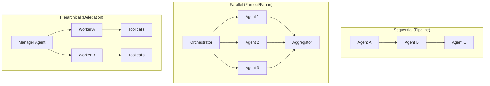

## Mission Brief

Complex tasks often benefit from specialized teams. Multi-agent systems let you decompose hard problems into subtasks, assign each to a specialized agent, and combine their results — just like a software engineering team.

> **Track:** Operative `••` | **Time:** 90 minutes | **Prerequisites:** [OPERATIVE-03](/posts/operative-03-rag/)

## Learning Objectives

By the end of this mission, you will:

1. Design orchestrator + subagent architectures
2. Implement sequential and parallel agent workflows
3. Build specialized agents with distinct roles
4. Handle agent failures and partial results
5. Know when multi-agent adds value vs. complexity

## Multi-Agent Patterns



## Hands-On Lab

### Step 1: Specialized Agent Factory

```python
import anthropic
from typing import Callable

client = anthropic.Anthropic()

def make_agent(role: str, expertise: str) -> Callable[[str], str]:
    """Create a specialized agent with a defined role."""
    system = f"""You are a {role}. Your expertise: {expertise}.
Be concise and focus strictly on your domain. Output only what's relevant to your specialty."""

    def agent(task: str) -> str:
        response = client.messages.create(
            model="claude-sonnet-4-6",
            max_tokens=512,
            system=system,
            messages=[{"role": "user", "content": task}]
        )
        return response.content[0].text

    return agent

# Create specialized agents
researcher   = make_agent("Research Analyst", "finding key facts and summarizing information")
writer       = make_agent("Technical Writer", "clear, structured writing for developers")
code_reviewer = make_agent("Senior Engineer", "code quality, security, and best practices")
critic       = make_agent("Devil's Advocate", "identifying flaws, risks, and weaknesses")
```

### Step 2: Sequential Pipeline

```python
def content_pipeline(topic: str) -> dict:
    """Research → Draft → Critique → Revise pipeline."""
    print(f"Pipeline starting for: {topic}\n")

    print("[1/4] Researching...")
    research = researcher(f"Find 5 key facts about: {topic}")

    print("[2/4] Writing...")
    draft = writer(f"""Write a 200-word technical summary about: {topic}
Use these research points:
{research}""")

    print("[3/4] Critiquing...")
    critique = critic(f"Find 3 weaknesses in this draft:\n{draft}")

    print("[4/4] Revising...")
    final = writer(f"""Revise this draft to address the critique:

Original draft:
{draft}

Critique:
{critique}

Produce an improved final version.""")

    return {
        "topic": topic,
        "research": research,
        "draft": draft,
        "critique": critique,
        "final": final
    }

result = content_pipeline("vector databases in production AI systems")
print("\n=== FINAL OUTPUT ===")
print(result["final"])
```

### Step 3: Parallel Agent Execution

```python
import concurrent.futures
import anthropic

client = anthropic.Anthropic()

def analyze_from_perspective(topic: str, perspective: str) -> dict:
    response = client.messages.create(
        model="claude-sonnet-4-6",
        max_tokens=256,
        system=f"You are an expert analyst focusing on: {perspective}. Be specific and concise.",
        messages=[{"role": "user", "content": f"Analyze '{topic}' from your perspective in 3 bullet points."}]
    )
    return {"perspective": perspective, "analysis": response.content[0].text}

def parallel_analysis(topic: str) -> list[dict]:
    """Run multiple specialized analyses in parallel."""
    perspectives = [
        "technical implementation challenges",
        "business value and ROI",
        "security and privacy risks",
        "developer experience and usability",
    ]

    print(f"Running {len(perspectives)} parallel analyses for: {topic}")

    with concurrent.futures.ThreadPoolExecutor(max_workers=4) as executor:
        futures = [
            executor.submit(analyze_from_perspective, topic, p)
            for p in perspectives
        ]
        results = [f.result() for f in concurrent.futures.as_completed(futures)]

    return results

# Run parallel analysis
results = parallel_analysis("deploying LLMs in enterprise environments")
for r in results:
    print(f"\n[{r['perspective'].upper()}]")
    print(r["analysis"])
```

### Step 4: Orchestrator-Worker Architecture

```python
import anthropic
import json

client = anthropic.Anthropic()

WORKER_REGISTRY = {
    "summarizer": "You are a concise summarizer. Condense text to key points.",
    "translator": "You are a technical translator. Translate concepts to simple language for non-technical audiences.",
    "formatter": "You are a document formatter. Structure content into clean markdown with headers and tables.",
}

def run_worker(worker_name: str, task: str) -> str:
    system = WORKER_REGISTRY.get(worker_name, "You are a general assistant.")
    response = client.messages.create(
        model="claude-sonnet-4-6",
        max_tokens=512,
        system=system,
        messages=[{"role": "user", "content": task}]
    )
    return response.content[0].text

ORCHESTRATOR_TOOLS = [
    {
        "name": "delegate_to_worker",
        "description": "Delegate a task to a specialized worker agent.",
        "input_schema": {
            "type": "object",
            "properties": {
                "worker": {
                    "type": "string",
                    "enum": list(WORKER_REGISTRY.keys()),
                    "description": "The worker to delegate to"
                },
                "task": {
                    "type": "string",
                    "description": "The specific task for this worker"
                }
            },
            "required": ["worker", "task"]
        }
    }
]

def orchestrate(request: str) -> str:
    """Orchestrator that delegates to specialized workers."""
    messages = [{"role": "user", "content": request}]
    system = f"""You are an orchestrator that manages specialized workers.
Available workers: {', '.join(WORKER_REGISTRY.keys())}
Decompose tasks and delegate to appropriate workers. Combine their outputs into a final response."""

    while True:
        response = client.messages.create(
            model="claude-sonnet-4-6",
            max_tokens=1024,
            system=system,
            tools=ORCHESTRATOR_TOOLS,
            messages=messages,
        )

        if response.stop_reason == "end_turn":
            return next(b.text for b in response.content if hasattr(b, "text"))

        if response.stop_reason == "tool_use":
            messages.append({"role": "assistant", "content": response.content})
            tool_results = []
            for block in response.content:
                if block.type == "tool_use":
                    worker_output = run_worker(block.input["worker"], block.input["task"])
                    print(f"  [Worker: {block.input['worker']}] completed")
                    tool_results.append({
                        "type": "tool_result",
                        "tool_use_id": block.id,
                        "content": worker_output,
                    })
            messages.append({"role": "user", "content": tool_results})

result = orchestrate("Take this dense technical paragraph and make it: (1) summarized, (2) accessible to non-engineers, and (3) formatted cleanly. Paragraph: 'Transformer architectures leverage self-attention mechanisms to compute context-dependent representations across entire sequences simultaneously, enabling parallelization during training and superior capture of long-range dependencies compared to recurrent models.'")
print(result)
```

---

## Mission Complete

You can now build multi-agent systems:

- [x] Specialized agents with distinct roles
- [x] Sequential pipelines for multi-step processing
- [x] Parallel execution for speed and diverse perspectives
- [x] Orchestrator-worker delegation with tool use

---

## Navigation

**← Previous:** [OPERATIVE-03: Retrieval-Augmented Generation](/posts/operative-03-rag/)  
**Next Mission →** [OPERATIVE-05: AI Safety & Responsible Development](/posts/operative-05-ai-safety/)
