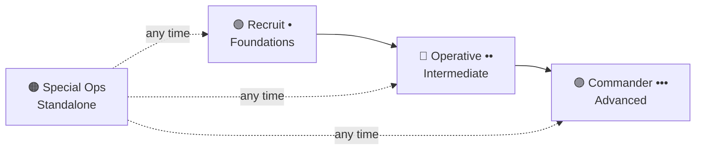

## Mission Brief

Welcome, Recruit. You've just joined **AI-Workshop** — a mission-based platform where you'll master AI development through hands-on challenges, not passive reading. This orientation mission explains how the platform works and sets you up for success.

> **Track:** Recruit `•` | **Time:** 15 minutes | **Prerequisites:** None

## Learning Objectives

By the end of this mission, you will:

1. Understand the four mission tracks and how they progress
2. Know what tools and accounts you'll need throughout the workshop
3. Be able to navigate the platform and find missions
4. Have your learning environment ready for RECRUIT-01

## The Mission Structure

Every mission on AI-Workshop follows a consistent structure so you always know what to expect:

| Section | Purpose |
|---------|---------|
| **Mission Brief** | What this mission is about and how long it takes |
| **Learning Objectives** | What you'll be able to do after completing it |
| **Background** | Concepts explained before hands-on work |
| **Hands-On Lab** | Step-by-step exercises you actually complete |
| **Mission Complete** | Summary of what you learned |
| **Next Mission** | Where to go next |

## The Four Tracks



### Recruit `•` — Foundational
Sequential missions covering AI basics, the Claude API, and prompt engineering. Start here if you're new to AI development.

### Operative `••` — Intermediate
Agents, tool use, RAG, and multi-agent systems. Complete the Recruit track first.

### Commander `•••` — Advanced
Production AI architecture, large-scale deployments, and AI systems design. Coming soon.

### Special Ops — Standalone
Self-contained missions on specific tools (MCP, Claude Code, AI Security). No prerequisites — take them whenever you're ready.

## Hands-On Lab: Environment Setup

### Step 1: Create Required Accounts

You'll need these accounts to complete the workshop missions:

- [ ] **GitHub** — [github.com](https://github.com) (for code hosting, this platform's comments, and project tracking)
- [ ] **Anthropic Console** — [console.anthropic.com](https://console.anthropic.com) (for Claude API access)

### Step 2: Get Your Claude API Key

1. Log in to [console.anthropic.com](https://console.anthropic.com)
2. Navigate to **API Keys** in the left sidebar
3. Click **Create Key** and name it `ai-workshop`
4. Copy the key — you'll only see it once!
5. Store it safely (a password manager is ideal)

> **Security Note:** Never commit your API key to a repository. Always use environment variables.

### Step 3: Set Up Your Local Environment

Install the required tools:

```bash
# Verify Python 3.10+ is installed
python3 --version

# Install the Anthropic SDK
pip install anthropic

# Set your API key as an environment variable
export ANTHROPIC_API_KEY="your-api-key-here"
```

To make the environment variable permanent, add it to your shell profile (`~/.bashrc`, `~/.zshrc`, etc.):

```bash
echo 'export ANTHROPIC_API_KEY="your-api-key-here"' >> ~/.zshrc
source ~/.zshrc
```

### Step 4: Verify Your Setup

Run this quick sanity-check script:

```python
import anthropic

client = anthropic.Anthropic()

message = client.messages.create(
    model="claude-sonnet-4-6",
    max_tokens=64,
    messages=[{"role": "user", "content": "Say 'AI-Workshop ready!' and nothing else."}]
)

print(message.content[0].text)
```

Expected output:
```
AI-Workshop ready!
```

If you see that output, you're fully set up and ready for the missions ahead.

---

## Mission Complete

You've completed your orientation. Here's what you set up:

- [x] Mission track structure understood
- [x] Anthropic Console account created
- [x] Claude API key stored safely
- [x] Python environment configured
- [x] SDK installation verified

---

## Navigation

**Next Mission →** [RECRUIT-01: Introduction to AI & LLMs](/posts/recruit-01-intro-llms/)
