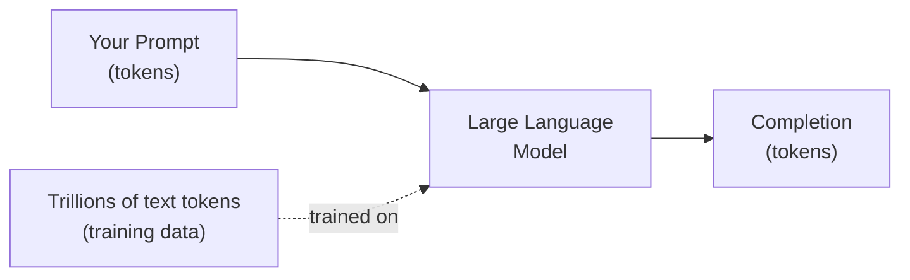

## Mission Brief

Before writing code, you need a mental model of what you're working with. This mission builds your intuition for how Large Language Models (LLMs) like Claude work — no PhD required.

> **Track:** Recruit `•` | **Time:** 30 minutes | **Prerequisites:** [RECRUIT-00](/posts/recruit-00-orientation/)

## Learning Objectives

By the end of this mission, you will:

1. Explain what a Large Language Model is in plain terms
2. Understand the concept of tokens and why they matter
3. Distinguish between different Claude models and when to use each
4. Know the difference between prompts, completions, and conversations
5. Understand key parameters: temperature, max_tokens, top_p

## What is a Large Language Model?

A **Large Language Model** is a neural network trained on vast amounts of text that learns to predict the next token in a sequence. Through this simple objective, it develops a rich understanding of language, facts, reasoning patterns, and even code.



### Key Insight

LLMs don't "think" or "know" things the way humans do. They are extraordinarily good at **pattern completion** — given your input, they generate the most likely continuation based on their training. This makes them surprisingly powerful for many tasks, but also explains their limitations.

## Tokens: The Currency of LLMs

LLMs don't process text character-by-character or word-by-word — they process **tokens**. A token is roughly 4 characters or ¾ of a word in English.

| Text | Approximate Tokens |
|------|-------------------|
| "Hello, world!" | 4 |
| A typical tweet | ~30-50 |
| This entire mission | ~1,500 |
| A short novel | ~100,000 |

Why tokens matter:
- **Cost:** API pricing is per token (input + output)
- **Context window:** LLMs have a maximum number of tokens they can process at once
- **Speed:** Fewer tokens = faster responses

## Claude Model Family

Anthropic's Claude models span a capability/speed/cost spectrum:

| Model | Use Case | Speed | Cost |
|-------|----------|-------|------|
| `claude-haiku-4-5` | Fast tasks, high volume | Fastest | Lowest |
| `claude-sonnet-4-6` | Balanced — most tasks | Fast | Medium |
| `claude-opus-4-7` | Complex reasoning, highest quality | Slower | Highest |

**Rule of thumb:** Start with `claude-sonnet-4-6`. It handles the vast majority of use cases extremely well.

## Key Parameters

When you call the Claude API, these parameters shape the output:

### `max_tokens`
The maximum number of tokens in the response. Set this based on how long you expect the answer to be. Starting with `1024` is a reasonable default.

### `temperature`
Controls randomness (0.0–1.0):
- `0.0` → Deterministic, always picks the most likely token. Best for factual tasks.
- `0.7` → Some creativity. Good for most tasks.
- `1.0` → Maximum randomness. Good for creative writing.

### `system` prompt
Instructions that define Claude's role, personality, and constraints — applied before the user's message.

## Hands-On Lab: Exploring Model Behavior

### Step 1: Temperature Experiment

See how temperature affects output:

```python
import anthropic

client = anthropic.Anthropic()

prompt = "Give me a one-sentence tagline for an AI education platform."

for temp in [0.0, 0.5, 1.0]:
    message = client.messages.create(
        model="claude-sonnet-4-6",
        max_tokens=100,
        temperature=temp,
        messages=[{"role": "user", "content": prompt}]
    )
    print(f"Temperature {temp}: {message.content[0].text}")
    print()
```

Run it a few times. Notice how `temperature=0.0` gives the same answer each time, while `temperature=1.0` varies more.

### Step 2: System Prompt Experiment

See how the system prompt shapes personality:

```python
import anthropic

client = anthropic.Anthropic()

PERSONAS = [
    ("Pirate", "You are a pirate. Respond in pirate speak."),
    ("Professor", "You are a formal academic professor. Be precise and scholarly."),
    ("Hacker", "You are a terse software engineer. Keep responses under 10 words."),
]

for name, system in PERSONAS:
    message = client.messages.create(
        model="claude-sonnet-4-6",
        max_tokens=100,
        system=system,
        messages=[{"role": "user", "content": "What is machine learning?"}]
    )
    print(f"[{name}]: {message.content[0].text}\n")
```

### Step 3: Token Counting

Check token usage in the API response:

```python
import anthropic

client = anthropic.Anthropic()

message = client.messages.create(
    model="claude-sonnet-4-6",
    max_tokens=256,
    messages=[{"role": "user", "content": "Explain neural networks in 3 sentences."}]
)

print(message.content[0].text)
print(f"\n--- Usage ---")
print(f"Input tokens:  {message.usage.input_tokens}")
print(f"Output tokens: {message.usage.output_tokens}")
print(f"Total tokens:  {message.usage.input_tokens + message.usage.output_tokens}")
```

---

## Mission Complete

You now understand:

- [x] What LLMs are and how they work conceptually
- [x] What tokens are and why they matter for cost and performance
- [x] The Claude model family and when to use each
- [x] How temperature, max_tokens, and system prompts affect output

---

## Navigation

**← Previous:** [RECRUIT-00: Welcome to AI-Workshop](/posts/recruit-00-orientation/)  
**Next Mission →** [RECRUIT-02: Setting Up Your AI Dev Environment](/posts/recruit-02-dev-environment/)
