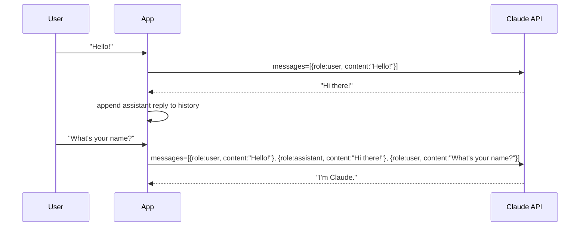

## Mission Brief

Theory is fine; building is better. In this mission you'll build a real, working multi-turn conversational AI application with streaming output — the same architecture used in production chat applications.

> **Track:** Recruit `•` | **Time:** 45 minutes | **Prerequisites:** [RECRUIT-02](/posts/recruit-02-dev-environment/)

## Learning Objectives

By the end of this mission, you will:

1. Implement multi-turn conversations with conversation history
2. Use streaming to display responses in real-time
3. Build a simple CLI chat loop
4. Handle API errors gracefully
5. Structure a conversational AI application properly

## How Multi-Turn Conversations Work

The Claude API is stateless — it doesn't remember previous messages. You must send the full conversation history with every request.



Each API call carries the **entire conversation history**. This is what enables contextual, coherent conversations.

## Hands-On Lab

### Step 1: Basic Multi-Turn Chat

Create `src/chat.py`:

```python
import os
from dotenv import load_dotenv
import anthropic

load_dotenv()

client = anthropic.Anthropic()

def chat(system_prompt: str = "You are a helpful AI assistant."):
    """Run an interactive multi-turn chat loop."""
    history = []

    print(f"System: {system_prompt}")
    print("Type 'exit' to quit, 'clear' to reset conversation.\n")

    while True:
        user_input = input("You: ").strip()

        if user_input.lower() == "exit":
            break
        if user_input.lower() == "clear":
            history = []
            print("[Conversation cleared]\n")
            continue
        if not user_input:
            continue

        history.append({"role": "user", "content": user_input})

        response = client.messages.create(
            model="claude-sonnet-4-6",
            max_tokens=1024,
            system=system_prompt,
            messages=history,
        )

        assistant_message = response.content[0].text
        history.append({"role": "assistant", "content": assistant_message})

        print(f"\nClaude: {assistant_message}\n")

if __name__ == "__main__":
    chat("You are a helpful AI tutor specializing in explaining AI concepts clearly.")
```

Run it: `python src/chat.py`

### Step 2: Add Streaming

Streaming makes responses feel much more responsive. Replace the API call with streaming:

```python
import os
from dotenv import load_dotenv
import anthropic

load_dotenv()

client = anthropic.Anthropic()

def chat_streaming(system_prompt: str = "You are a helpful AI assistant."):
    """Run a streaming multi-turn chat loop."""
    history = []

    print(f"System: {system_prompt}")
    print("Type 'exit' to quit.\n")

    while True:
        user_input = input("You: ").strip()
        if user_input.lower() == "exit":
            break
        if not user_input:
            continue

        history.append({"role": "user", "content": user_input})

        print("\nClaude: ", end="", flush=True)
        full_response = ""

        with client.messages.stream(
            model="claude-sonnet-4-6",
            max_tokens=1024,
            system=system_prompt,
            messages=history,
        ) as stream:
            for text in stream.text_stream:
                print(text, end="", flush=True)
                full_response += text

        print("\n")
        history.append({"role": "assistant", "content": full_response})

if __name__ == "__main__":
    chat_streaming("You are a helpful AI tutor specializing in Python programming.")
```

### Step 3: Add Error Handling

Production applications need graceful error handling:

```python
import anthropic

def safe_chat(client: anthropic.Anthropic, history: list, system: str) -> str:
    try:
        response = client.messages.create(
            model="claude-sonnet-4-6",
            max_tokens=1024,
            system=system,
            messages=history,
        )
        return response.content[0].text

    except anthropic.RateLimitError:
        return "[Error: Rate limit hit. Please wait a moment and try again.]"
    except anthropic.APIConnectionError:
        return "[Error: Could not connect to the API. Check your internet connection.]"
    except anthropic.AuthenticationError:
        return "[Error: Invalid API key. Check your ANTHROPIC_API_KEY.]"
    except anthropic.APIError as e:
        return f"[API Error: {e}]"
```

### Step 4: Build a Persona Chat App

Combine everything into a polished application with selectable personas:

```python
import os
import sys
from dotenv import load_dotenv
import anthropic

load_dotenv()
client = anthropic.Anthropic()

PERSONAS = {
    "1": ("AI Tutor", "You are an expert AI tutor. Explain concepts clearly with examples."),
    "2": ("Code Reviewer", "You are a senior software engineer. Review code critically and suggest improvements."),
    "3": ("Brainstormer", "You are a creative brainstorming partner. Generate diverse, unconventional ideas."),
}

def select_persona() -> tuple[str, str]:
    print("Select a persona:")
    for key, (name, _) in PERSONAS.items():
        print(f"  {key}. {name}")
    choice = input("\nEnter number (default: 1): ").strip() or "1"
    name, system = PERSONAS.get(choice, PERSONAS["1"])
    print(f"\n[Started chat with: {name}]\n")
    return name, system

def main():
    _, system = select_persona()
    history = []

    while True:
        try:
            user_input = input("You: ").strip()
        except (KeyboardInterrupt, EOFError):
            print("\nGoodbye!")
            sys.exit(0)

        if not user_input or user_input.lower() == "exit":
            break

        history.append({"role": "user", "content": user_input})
        print("\nClaude: ", end="", flush=True)
        full_response = ""

        with client.messages.stream(
            model="claude-sonnet-4-6",
            max_tokens=1024,
            system=system,
            messages=history,
        ) as stream:
            for text in stream.text_stream:
                print(text, end="", flush=True)
                full_response += text

        print("\n")
        history.append({"role": "assistant", "content": full_response})

if __name__ == "__main__":
    main()
```

---

## Mission Complete

You've built a production-pattern conversational AI application:

- [x] Multi-turn conversation with full history management
- [x] Streaming responses for real-time output
- [x] Graceful error handling for API failures
- [x] Persona selection for different use cases

---

## Navigation

**← Previous:** [RECRUIT-02: Setting Up Your AI Dev Environment](/posts/recruit-02-dev-environment/)  
**Next Mission →** [RECRUIT-04: Prompt Engineering Fundamentals](/posts/recruit-04-prompt-engineering/)
