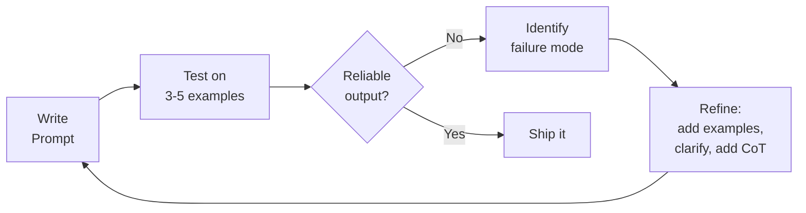

## Mission Brief

Prompt engineering is how you reliably control LLM behavior without changing any code. Mastering these techniques is what separates developers who fight the model from those who harness it.

> **Track:** Recruit `•` | **Time:** 60 minutes | **Prerequisites:** [RECRUIT-03](/posts/recruit-03-first-app/)

## Learning Objectives

By the end of this mission, you will:

1. Write clear, unambiguous system and user prompts
2. Use few-shot examples to shape output format
3. Apply Chain-of-Thought to improve reasoning accuracy
4. Use XML tags to structure complex prompts
5. Evaluate prompt quality and iterate effectively

## Core Prompt Engineering Techniques

### 1. Be Specific and Direct

Vague prompts produce vague results. Specific prompts produce specific results.

| Weak Prompt | Strong Prompt |
|-------------|---------------|
| "Summarize this" | "Summarize the following article in exactly 3 bullet points, each under 15 words" |
| "Write some code" | "Write a Python function that reads a CSV file and returns a list of dicts, one per row" |
| "Explain AI" | "Explain what a neural network is to a 12-year-old using an analogy to a human brain" |

### 2. Few-Shot Prompting

Show the model examples of the input/output format you want:

```python
import anthropic

client = anthropic.Anthropic()

FEW_SHOT_PROMPT = """Classify the sentiment of the following customer reviews.
Respond with only: POSITIVE, NEGATIVE, or NEUTRAL.

Review: "This product is amazing! Exceeded all my expectations."
Sentiment: POSITIVE

Review: "Returned it. Broke after 2 days."
Sentiment: NEGATIVE

Review: "It arrived on time. Does what it says."
Sentiment: NEUTRAL

Review: {review}
Sentiment:"""

reviews = [
    "Best purchase I've made this year!",
    "Completely useless. Wasted my money.",
    "Average product. Nothing special.",
]

for review in reviews:
    message = client.messages.create(
        model="claude-sonnet-4-6",
        max_tokens=10,
        messages=[{"role": "user", "content": FEW_SHOT_PROMPT.format(review=review)}]
    )
    print(f"Review: {review[:40]}...")
    print(f"Sentiment: {message.content[0].text.strip()}\n")
```

### 3. Chain-of-Thought (CoT) Prompting

For complex reasoning tasks, ask the model to think step-by-step before giving an answer:

```python
import anthropic

client = anthropic.Anthropic()

# Without CoT — often gets complex problems wrong
no_cot = client.messages.create(
    model="claude-sonnet-4-6",
    max_tokens=50,
    messages=[{"role": "user", "content": "A store offers 20% off, then an additional 15% off the sale price. What is the total discount on a $100 item?"}]
)

# With CoT — accurate and explainable
with_cot = client.messages.create(
    model="claude-sonnet-4-6",
    max_tokens=300,
    messages=[{"role": "user", "content": """A store offers 20% off, then an additional 15% off the sale price.
What is the total discount on a $100 item?

Think through this step by step before giving your answer."""}]
)

print("Without CoT:", no_cot.content[0].text)
print("\nWith CoT:\n", with_cot.content[0].text)
```

### 4. XML Tags for Complex Prompts

When prompts contain multiple distinct components, XML tags improve reliability significantly:

```python
import anthropic

client = anthropic.Anthropic()

def analyze_code(code: str, language: str = "Python") -> str:
    prompt = f"""<task>
Review the following code and provide structured feedback.
</task>

<language>{language}</language>

<code>
{code}
</code>

<output_format>
Provide your analysis in exactly these sections:
1. **Summary** (1 sentence)
2. **Issues** (bullet list of problems found, or "None" if clean)
3. **Suggestions** (bullet list of improvements)
4. **Rating** (1-10 scale)
</output_format>"""

    message = client.messages.create(
        model="claude-sonnet-4-6",
        max_tokens=512,
        messages=[{"role": "user", "content": prompt}]
    )
    return message.content[0].text

sample_code = """
def calculate_average(numbers):
    total = 0
    for n in numbers:
        total = total + n
    return total / len(numbers)
"""

print(analyze_code(sample_code))
```

### 5. Output Formatting

Force structured output with explicit format instructions:

```python
import anthropic
import json

client = anthropic.Anthropic()

def extract_action_items(meeting_notes: str) -> list[dict]:
    message = client.messages.create(
        model="claude-sonnet-4-6",
        max_tokens=512,
        system="You are a meeting notes parser. Always respond with valid JSON only. No markdown, no explanation.",
        messages=[{
            "role": "user",
            "content": f"""Extract action items from these meeting notes.

Return a JSON array of objects with these fields:
- "task": string (what needs to be done)
- "owner": string (who is responsible, or "TBD" if unclear)
- "due": string (deadline if mentioned, or "Not specified")

Meeting notes:
{meeting_notes}"""
        }]
    )

    return json.loads(message.content[0].text)

notes = """
Team sync - April 24
- Alice will update the API docs by Friday
- Bob needs to review the PR from last week
- Deployment to be scheduled — check with DevOps
"""

items = extract_action_items(notes)
for item in items:
    print(f"• [{item['owner']}] {item['task']} (Due: {item['due']})")
```

## The Prompt Iteration Loop



Always test prompts on **diverse examples**, including edge cases. A prompt that works on 3 happy-path examples may fail on the 4th.

---

## Mission Complete

You now have the core prompt engineering toolkit:

- [x] Specific, unambiguous prompt writing
- [x] Few-shot examples for format control
- [x] Chain-of-Thought for complex reasoning
- [x] XML tags for structured complex prompts
- [x] Structured output extraction

You've completed the **Recruit Track**. You're ready to advance.

---

## Navigation

**← Previous:** [RECRUIT-03: Your First AI Application](/posts/recruit-03-first-app/)  
**Next Track →** [OPERATIVE-01: Building Conversational AI Agents](/posts/operative-01-ai-agents/)
