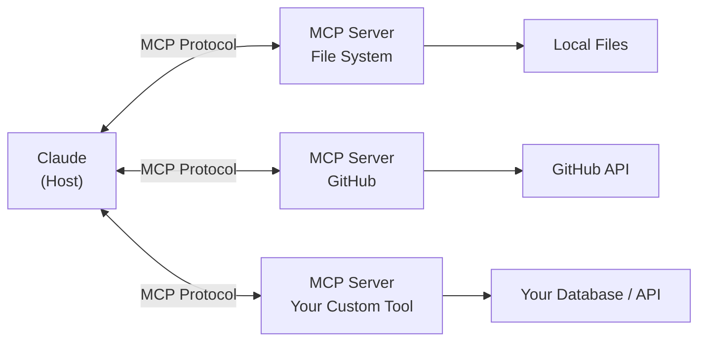

## Mission Brief

The Model Context Protocol (MCP) is an open standard that lets Claude (and other AI assistants) connect to external tools, data sources, and services through a unified interface. Think of it as a "USB standard for AI tools" — write a server once, use it anywhere MCP is supported.

> **Track:** Special Ops | **Time:** 90 minutes | **Prerequisites:** None (Recruit Track recommended)

## Learning Objectives

By the end of this mission, you will:

1. Understand what MCP is and why it matters
2. Run existing MCP servers with Claude Desktop
3. Build a custom MCP server in Python
4. Test your MCP server locally with the MCP Inspector
5. Connect your MCP server to Claude Code

## What is MCP?



MCP uses a client-server architecture over stdio (for local servers) or HTTP+SSE (for remote servers). An MCP server exposes:

- **Tools** — Functions Claude can call (like function calling, but via MCP)
- **Resources** — Data sources Claude can read (files, URLs, database records)
- **Prompts** — Reusable prompt templates

## Hands-On Lab

### Step 1: Install Claude Desktop and Enable MCP

1. Download [Claude Desktop](https://claude.ai/download) (macOS or Windows)
2. Open Claude Desktop → Settings → Developer
3. Enable "Model Context Protocol"

### Step 2: Add an Existing MCP Server

Add the official filesystem MCP server to Claude Desktop config:

**macOS**: `~/Library/Application Support/Claude/claude_desktop_config.json`  
**Windows**: `%APPDATA%\Claude\claude_desktop_config.json`

```json
{
  "mcpServers": {
    "filesystem": {
      "command": "npx",
      "args": [
        "-y",
        "@modelcontextprotocol/server-filesystem",
        "/Users/yourname/Documents"
      ]
    }
  }
}
```

Restart Claude Desktop. You can now ask: *"List the files in my Documents folder"* and Claude will use the MCP tool.

### Step 3: Build a Custom MCP Server in Python

Install the MCP Python SDK:

```bash
pip install mcp
```

Create `my_mcp_server.py`:

```python
import json
import os
from mcp.server import Server
from mcp.server.stdio import stdio_server
from mcp import types

server = Server("ai-workshop-tools")

# Register a tool
@server.list_tools()
async def list_tools() -> list[types.Tool]:
    return [
        types.Tool(
            name="get_workshop_info",
            description="Get information about an AI-Workshop mission track",
            inputSchema={
                "type": "object",
                "properties": {
                    "track": {
                        "type": "string",
                        "description": "The track name: recruit, operative, commander, or special-ops",
                        "enum": ["recruit", "operative", "commander", "special-ops"]
                    }
                },
                "required": ["track"]
            }
        ),
        types.Tool(
            name="save_note",
            description="Save a note to a local markdown file",
            inputSchema={
                "type": "object",
                "properties": {
                    "filename": {"type": "string", "description": "Filename without extension"},
                    "content": {"type": "string", "description": "Markdown content to save"}
                },
                "required": ["filename", "content"]
            }
        )
    ]

# Handle tool calls
@server.call_tool()
async def call_tool(name: str, arguments: dict) -> list[types.TextContent]:
    if name == "get_workshop_info":
        track = arguments["track"]
        info = {
            "recruit": "5 foundational missions covering AI basics, Claude API, and prompt engineering. Start here.",
            "operative": "5 intermediate missions: agents, tool use, RAG, multi-agent, and AI safety.",
            "commander": "Advanced production AI systems. Coming soon.",
            "special-ops": "3 standalone missions: MCP, Claude Code, and AI Security. No prerequisites.",
        }
        return [types.TextContent(type="text", text=info.get(track, "Track not found."))]

    elif name == "save_note":
        filename = arguments["filename"].replace("/", "_") + ".md"
        path = os.path.join(os.path.expanduser("~"), "ai-workshop-notes", filename)
        os.makedirs(os.path.dirname(path), exist_ok=True)
        with open(path, "w") as f:
            f.write(arguments["content"])
        return [types.TextContent(type="text", text=f"Note saved to {path}")]

    return [types.TextContent(type="text", text=f"Unknown tool: {name}")]

async def main():
    async with stdio_server() as streams:
        await server.run(streams[0], streams[1], server.create_initialization_options())

if __name__ == "__main__":
    import asyncio
    asyncio.run(main())
```

### Step 4: Register Your Server with Claude Desktop

Add to `claude_desktop_config.json`:

```json
{
  "mcpServers": {
    "ai-workshop": {
      "command": "python",
      "args": ["/absolute/path/to/my_mcp_server.py"]
    }
  }
}
```

Restart Claude Desktop. Now ask: *"What's in the Operative track of AI-Workshop?"*

### Step 5: Test with MCP Inspector

The MCP Inspector is a web-based debugging tool:

```bash
npx @modelcontextprotocol/inspector python my_mcp_server.py
```

This opens a UI where you can call tools directly and inspect protocol messages — invaluable for debugging.

### Step 6: Use Your MCP Server with Claude Code

Add to your project's `.claude/settings.json` (or `~/.claude/settings.json`):

```json
{
  "mcpServers": {
    "ai-workshop": {
      "command": "python",
      "args": ["/absolute/path/to/my_mcp_server.py"]
    }
  }
}
```

Claude Code will now have access to your custom tools during coding sessions.

---

## Mission Complete

You've built and deployed a custom MCP server:

- [x] Understand MCP architecture and protocol
- [x] Connected an existing MCP server to Claude Desktop
- [x] Built a custom MCP server with multiple tools
- [x] Tested with MCP Inspector
- [x] Connected to Claude Code

---

## Navigation

**← Previous:** [OPERATIVE-05: AI Safety & Responsible Development](/posts/operative-05-ai-safety/)  
**Next Special Op →** [SPECIAL-OPS-02: Claude Code Workshop](/posts/special-ops-02-claude-code/)
