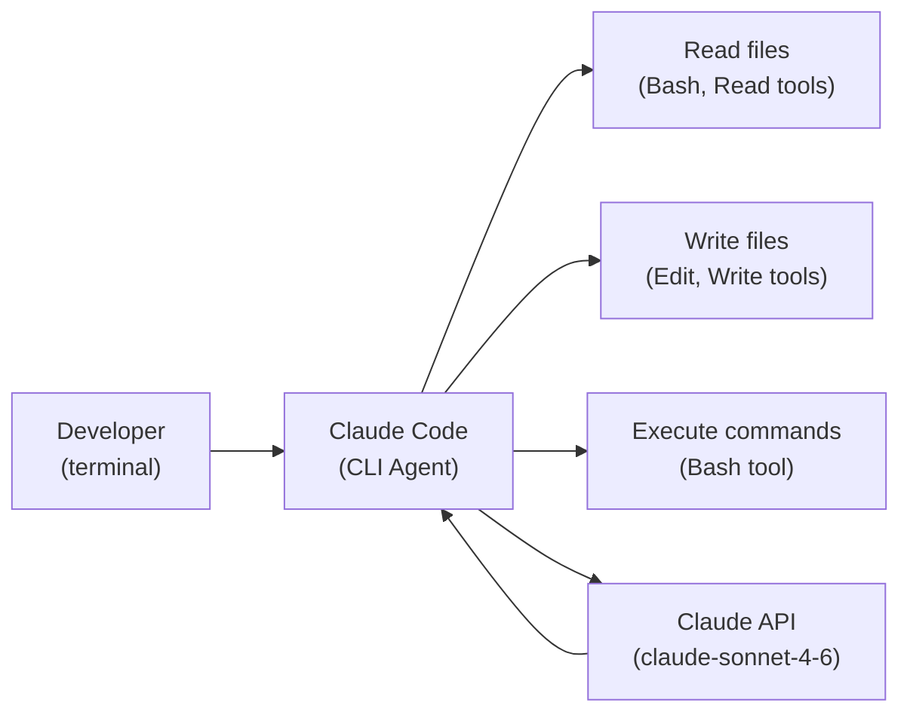

## Mission Brief

Claude Code is an AI-powered terminal agent that can read, write, and reason about your codebase. Unlike simple code completion, it understands project context and executes multi-step engineering tasks. This mission covers everything from installation to power user techniques.

> **Track:** Special Ops | **Time:** 60 minutes | **Prerequisites:** None

## Learning Objectives

By the end of this mission, you will:

1. Install and configure Claude Code
2. Understand the permission model and safe defaults
3. Use CLAUDE.md for project-specific context
4. Create custom slash commands for your workflow
5. Configure MCP servers for enhanced capabilities

## How Claude Code Works



Claude Code is an agent loop. It reads your codebase, plans changes, uses tools to implement them, and verifies the results — all in a single session.

## Hands-On Lab

### Step 1: Installation

```bash
# Requires Node.js 18+
npm install -g @anthropic-ai/claude-code

# Verify installation
claude --version

# Login (uses your Anthropic API key or Claude.ai subscription)
claude
```

### Step 2: Core Commands

```bash
# Start interactive session in current project
claude

# One-shot command (non-interactive)
claude -p "Explain what this codebase does in 3 sentences"

# Resume the most recent session
claude --continue

# View conversation history
claude --resume
```

### Step 3: Understanding Permissions

Claude Code asks permission before taking actions. The permission model has three levels:

| Mode | Behavior |
|------|---------|
| Default | Prompts for approval on file writes, bash commands |
| `--dangerously-skip-permissions` | Auto-approves everything (use with caution) |
| Project settings | Configure fine-grained permissions in `.claude/settings.json` |

Configure allowed commands in `.claude/settings.json`:

```json
{
  "allowedTools": [
    {"tool": "Bash", "pattern": "npm test"},
    {"tool": "Bash", "pattern": "npm run build"},
    {"tool": "Bash", "pattern": "git status"},
    {"tool": "Bash", "pattern": "git diff"}
  ]
}
```

### Step 4: CLAUDE.md — Project Context

The `CLAUDE.md` file at your project root gives Claude Code persistent context about your project. Claude reads it automatically at the start of every session.

Create `CLAUDE.md` in your project:

```markdown
# Project: AI-Workshop Platform

## Overview
This is an AI workshop hosting platform built with Jekyll + Chirpy theme.
Deployed to GitHub Pages at https://akashtalole.github.io/AI-Workshop/

## Stack
- Jekyll (static site generator)
- Chirpy theme (jekyll-theme-chirpy ~> 7.3)
- GitHub Actions for CI/CD
- Giscus for comments (GitHub Discussions)

## Key Directories
- `_posts/` — Mission content as Jekyll posts (YYYY-MM-DD-slug.md)
- `_tabs/` — Sidebar navigation pages
- `_data/authors.yml` — Author profiles
- `.github/workflows/pages-deploy.yml` — CI/CD pipeline

## Content Guidelines
- New missions go in `_posts/` with proper front matter
- Categories follow pattern: [Track, Sub-category]
- Always include `toc: true` and `author: akashtalole`
- Use mermaid: true for diagrams

## Commit Convention
feat: for new missions
fix: for corrections
chore: for config/tooling changes

## Testing
bundle exec jekyll serve --livereload  # local preview
```

### Step 5: Custom Slash Commands

Slash commands are reusable prompts stored as markdown files. Place them in `.claude/commands/` to make them project-specific, or `~/.claude/commands/` to make them global.

**Create a new mission command** — `.claude/commands/new-mission.md`:

```markdown
Create a new AI-Workshop mission post with this title: $ARGUMENTS

Follow these requirements:
1. Create the file in `_posts/` with filename format `2026-04-24-{slug}.md`
2. Use the slug from the title (lowercase, hyphens)
3. Include complete front matter: title, date, categories, tags, description, toc: true, author: akashtalole
4. Include all standard sections: Mission Brief, Learning Objectives, Hands-On Lab (with at least 3 steps), Mission Complete, Navigation
5. Include at least one code block in the lab
6. Write the mission for an intermediate Python developer

Ask me which track (Recruit/Operative/Commander/Special-Ops) and time estimate before creating.
```

Use it: `/new-mission OPERATIVE-06: Fine-Tuning Claude Models`

**Create a review command** — `.claude/commands/review-mission.md`:

```markdown
Review the mission post for quality: $ARGUMENTS

Check for:
1. Front matter completeness (all required fields)
2. Correct category hierarchy [Track, Sub-category]
3. Navigation links (prev/next) point to real posts
4. Code examples are complete and runnable
5. Mission time estimate in the Mission Brief matches content length
6. All headings follow the standard structure

Report issues as a numbered list with file:line references.
```

### Step 6: Power User Techniques

```bash
# Pipe output into Claude Code
cat error.log | claude -p "What caused this error and how do I fix it?"

# Use Claude Code in CI (non-interactive)
claude -p "Run the test suite and summarize any failures" --no-interactive

# Ask about your git history
claude -p "Summarize the changes made in the last 5 commits"

# Code review before PR
claude -p "Review the staged changes for correctness, security issues, and style"
```

---

## Mission Complete

You're a Claude Code power user:

- [x] Installed and configured Claude Code
- [x] Permission model understood and configured
- [x] CLAUDE.md written for your project
- [x] Custom slash commands created
- [x] Power user techniques in your toolkit

---

## Navigation

**← Previous:** [SPECIAL-OPS-01: MCP Integration](/posts/special-ops-01-mcp/)  
**Next Special Op →** [SPECIAL-OPS-03: AI Security & Red-Teaming](/posts/special-ops-03-ai-security/)
